# Architecture Overview

Bucketwise Planner is a full-stack web application implementing Scott Pape's Barefoot Investor methodology. This document provides a high-level overview; detailed architecture documentation is in the backend and frontend README files.

**Attribution:** This project implements the Barefoot Investor methodology by Scott Pape ([www.barefootinvestor.com](https://www.barefootinvestor.com/))

## System Architecture

```mermaid
graph TB
    subgraph Frontend["🎨 Frontend (React 18 + Vite 7)"]
        FE["Dashboard | Fortnights | Debts | Transactions | Profile<br/>Mantine UI • TypeScript • JWT Auth<br/>Help System • Keyboard Shortcuts • Responsive Design"]
    end

    subgraph Backend["⚙️ Backend (Node.js + Express v5)"]
        subgraph Presentation["🌐 Presentation Layer"]
            PRES["HTTP Controllers • Routes • Middleware<br/>JWT Auth • Zod Validation • ApiResponse"]
        end
        
        subgraph Infrastructure["🗄️ Infrastructure Layer"]
            INFRA["PostgreSQL Repositories<br/>In-Memory Adapters • Database Persistence"]
        end
        
        subgraph Application["📋 Application Layer"]
            APP["Use Cases • Zod Schemas<br/>Error Mapping • DTO Orchestration"]
        end
        
        subgraph Domain["💼 Domain Layer (Pure Business Logic)"]
            DOMAIN["Money • Debt • Fortnight • Allocation<br/>No Express/Zod/DB Dependencies<br/>Business Rules & Invariants"]
        end
        
        PRES --> INFRA
        INFRA --> APPLICATION
        APPLICATION --> DOMAIN
        
        subgraph OptionalAI["🤖 Optional: Google Gemini AI Advisor"]
            AI["Disabled by default • Graceful degradation<br/>Requires GEMINI_API_KEY + AI_ENABLED=true"]
        end
    end

    subgraph Database["🗃️ PostgreSQL Database"]
        DB["Users • Fortnights • Transactions<br/>Debts • Debt Payments • Snapshots"]
    end

    FE -->|HTTP/REST<br/>TypeScript Client| PRES
    INFRA --> Database
    OptionalAI -.->|Optional| APP

    classDef frontend fill:#1e88e5,stroke:#1565c0,color:#fff
    classDef backend fill:#43a047,stroke:#2e7d32,color:#fff
    classDef database fill:#fb8c00,stroke:#e65100,color:#fff
    classDef layer fill:#5e35b1,stroke:#3f2c70,color:#fff
    classDef optional fill:#ff6f00,stroke:#bf360c,color:#fff
    
    class Frontend frontend
    class Backend backend
    class Database database
    class Presentation,Infrastructure,Application,Domain layer
    class OptionalAI optional
```



## Tech Stack

### Backend
- **Runtime:** Node.js 18+ (ESM modules)
- **Framework:** Express v5
- **Language:** TypeScript (strict mode)
- **Database:** PostgreSQL with node-postgres
- **Validation:** Zod schemas
- **Testing:** Vitest
- **Optional AI:** Google Gen AI SDK (Gemini 2.5 Flash)

### Frontend
- **Framework:** React 18
- **Build Tool:** Vite 7
- **Language:** TypeScript (strict mode)
- **UI Library:** Mantine v8.3.10 with custom dark theme
- **Icons:** Tabler Icons React
- **Date Handling:** Custom utilities (timezone-safe)

### Infrastructure
- **Containerization:** Docker + Docker Compose
- **Reverse Proxy:** Nginx (recommended for production)
- **Deployment:** Self-hosted (CasaOS compatible)

## Core Concepts

### Barefoot Buckets (Four Money Buckets)

All income is allocated into four buckets:

1. **Daily Expenses** (60%) — Groceries, transport, bills, essentials
2. **Splurge** (10%) — Guilt-free spending on wants
3. **Smile** (10%) — Long-term goals (holidays, vehicle upgrade, dream purchase)
4. **Fire Extinguisher** (20%) — Debt payoff acceleration → Emergency fund → Wealth

### Debt Snowball Method

1. List all debts with priority (1 = highest priority, lowest balance)
2. Minimum payment on all debts except priority 1
3. Fire Extinguisher amount applied to priority 1 (snowball effect)
4. As priority 1 is paid off, roll amount to priority 2
5. Repeat until debt-free
6. After debts paid, Fire Extinguisher becomes emergency fund and wealth builder

### Fortnights (Budgeting Periods)

- Budget cycles aligned with income (biweekly paychecks typical)
- Each fortnight has bucket allocations, transactions, and snapshots
- Snapshots track spent/remaining per bucket at any point
- Date format: YYYY-MM-DD (normalized to prevent timezone bugs)

### Key Patterns

**Date Normalization:**
- Always use `formatDateToISO()` utility (frontend/src/utils/formatters.ts)
- Returns YYYY-MM-DD format to prevent timezone drift
- Critical for fortnight matching and transaction date accuracy

**Timezone Model (v0.2.0+):**

Fortnights are evaluated in the user's local calendar, not UTC. This ensures transactions recorded around midnight are assigned to the intended fortnight regardless of the user's timezone.

**Design:**
- All event timestamps are stored in UTC
- User timezone (IANA, e.g., `Australia/Melbourne`) is stored in their profile
- Fortnight boundaries are interpreted as local calendar days:
  - Start: user's local midnight (converted to UTC)
  - End: exclusive boundary at midnight of the day after the local end date (converted to UTC)
- Server-side conversion: `TimezoneService.getFortnightBoundsUtc()` computes UTC bounds from local dates and user timezone
- Frontend coordination: Users select timezone in Profile view; backend uses it for all date boundary calculations
- Half-open interval: `[startUtc, endUtcExclusive)` — includes start, excludes end (standard practice)

**Example:**
- User in Australia/Melbourne records transaction at 2026-01-14 09:00 AEDT (2026-01-13 22:00 UTC)
- Fortnight is defined as local 2026-01-14 to 2026-01-27
- TimezoneService computes: startUtc = 2026-01-13 13:00 UTC, endUtcExclusive = 2026-01-27 13:00 UTC
- Transaction at 22:00 UTC on Jan 13 is >= startUtc and < endUtcExclusive, so it's included ✓

**DST Note:**
- `date-fns-tz` library handles DST transitions correctly; no special handling needed in application code
- Boundaries automatically adjust during DST changes (e.g., spring forward, fall back)

**API Envelope:**
```typescript
{
  success: boolean;
  data?: T;
  error?: { message: string; code: string };
}
```

**Error Handling:**
- Domain layer throws `ValidationError`, `DomainError`
- Application layer returns DTOs
- Presentation layer maps errors via `ErrorMapper` → HTTP responses
- Validation via Zod schemas (applied as middleware, never in controllers)

**Dependency Injection:**
- Manual constructor injection (no global singletons)
- Controllers thin — delegate to use cases
- All responses use `ApiResponse` envelope via `ResponseFormatter`

## Feature Overview

### Multi-User Authentication

- JWT-based signup/login per self-hosted instance
- Password hashing via bcryptjs (10 rounds)
- Refresh token support
- No centralized authentication (each instance independent)

### Dashboard

- Current fortnight overview (bucket allocations, spent/remaining)
- Debt summary (total balance, next priority payment)
- Payoff timeline (fortnightly progression)
- Quick access to add transactions or record debt payments

### Fortnights

- Create new budgeting periods with custom bucket allocations
- Navigate between fortnights (prev/next)
- View transactions per fortnight
- Update allocations if needed

### Transactions

- Record income, expenses, or debt payments
- Assign to bucket, add description, date, amount
- Filter by bucket, kind, fortnight, or date range
- View running totals per bucket

### Debts

- Create/track debts with balance, interest, minimum payment
- Set priority (1 = highest) for snowball method
- View calculated payoff timeline
- Record debt payments (manual or bulk "Record All")
- Skip payment functionality for missed cycles

### AI Advisor (Optional)

- Analyzes live budget data
- Provides personalized financial advice
- Based on Barefoot Investor principles
- Disabled by default (requires Google API key)
- Privacy-focused (no chat history stored)

## Testing

- **54+ passing tests** (Vitest)
- **Unit tests:** Domain entities, value objects, use cases, repositories
- **Integration tests:** API endpoints with test database
- **Deterministic:** No timing-dependent or flaky tests
- **Coverage:** >80% for critical paths

## Database Schema (High-Level)

**Core tables:**
- `users` — account credentials and profile (email, password hash)
- `fortnights` — budgeting periods (start_date, end_date, created_by)
- `allocations` — bucket allocations per fortnight (bucket_type, amount_cents)
- `transactions` — income/expense/debt payments (user_id, amount_cents, bucket, date, kind)
- `debts` — debt tracking (user_id, name, balance, minimum_payment, priority)
- `debt_payments` — recorded payments against debts (amount_cents, date, recorded_at)
- `fortnight_snapshots` — snapshots of bucket state (spent, remaining per bucket, per date)

See [backend/ARCHITECTURE.md](../backend/ARCHITECTURE.md) for detailed schema and domain models.

## API Endpoints (Overview)

### Authentication
- `POST /auth/signup` — Create account
- `POST /auth/login` — Login
- `POST /auth/refresh` — Refresh token
- `GET /auth/me` — Current user profile

### Fortnights
- `POST /fortnights` — Create fortnight
- `GET /fortnights` — List all fortnights
- `GET /fortnights/:id` — Get fortnight detail with bucket breakdowns

### Transactions
- `GET /transactions` (query: bucket, fortnightId, startDate, endDate) — Filtered list
- `POST /transactions` — Record transaction

### Debts
- `GET /debts` — List all debts
- `POST /debts` — Create debt
- `PUT /debts/:id` — Update debt
- `GET /debts/payoff-plan` — Snowball timeline calculator
- `POST /debts/:id/skip-payment` — Skip scheduled payment

### Dashboard
- `GET /dashboard` (query: currentFortnightId) — Consolidated view

### Profile
- `GET /profile` — Budget configuration
- `PUT /profile` — Update income, bucket %, fixed expenses

See [backend/README.md](../backend/README.md) for full API docs.

## For Developers

### Backend Deep Dive
Read [backend/ARCHITECTURE.md](../backend/ARCHITECTURE.md) for:
- Domain-Driven Design patterns
- Layer responsibilities
- Repository interfaces and patterns
- Use case examples
- Testing strategies

### Frontend Deep Dive
Read [frontend/README.md](../frontend/README.md) for:
- Component structure and patterns
- Help system and keyboard shortcuts
- Mantine theme customization
- API client usage
- State management approach

### Contributing
See [CONTRIBUTING.md](../CONTRIBUTING.md) for:
- Local development setup
- Code style and standards
- Testing requirements
- PR submission process
- Important patterns (date handling, error handling, DDD principles)

## Key Implementation Notes

1. **Currency:** All amounts stored in cents (integer arithmetic) — prevents floating-point errors
2. **Timezones:** Dates normalized to YYYY-MM-DD to prevent timezone drift across time zones
3. **Buckets:** Hard-coded 60/10/10/20 split (per Barefoot Investor), but percentages configurable per user profile
4. **Fortnights:** Not months — aligns with biweekly income cycles (typical Australia)
5. **Debt Snowball:** Prioritized by user choice (not balance); automatic rollover to next priority
6. **AI Optional:** Disabled by default; no third-party dependency required for core functionality
7. **Single-Tenant:** Each self-hosted instance is independent (not SaaS)

## Roadmap & Community

Check [docs/FEATURE_WISHLIST.md](FEATURE_WISHLIST.md) for planned features and community ideas.

**Contributions welcome!** See [CONTRIBUTING.md](../CONTRIBUTING.md).

---

**Questions?** See [docs/FAQ.md](FAQ.md) or open an issue on [GitHub](https://github.com/PaulAtkins88/bucketwise-planner).
